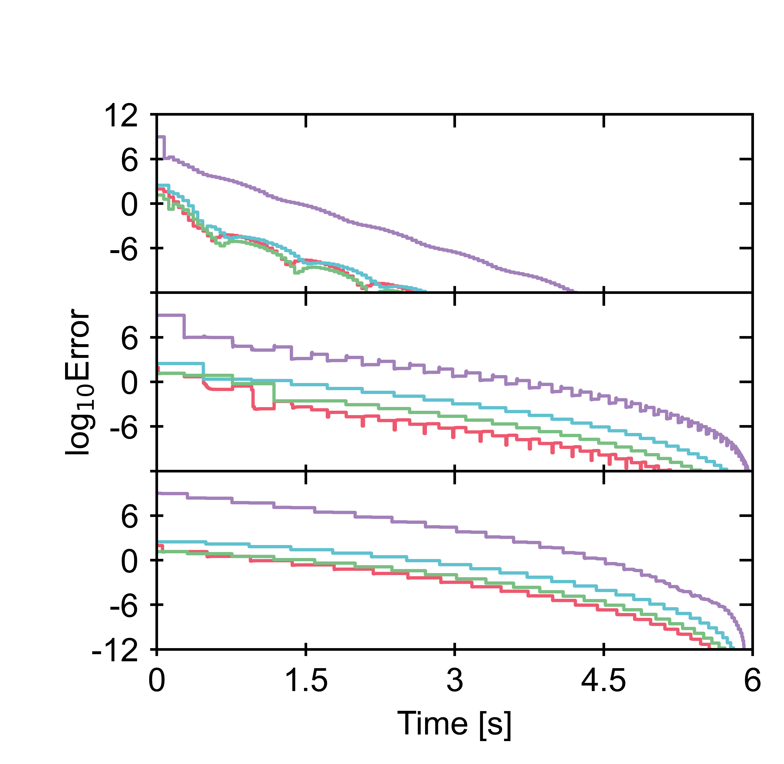
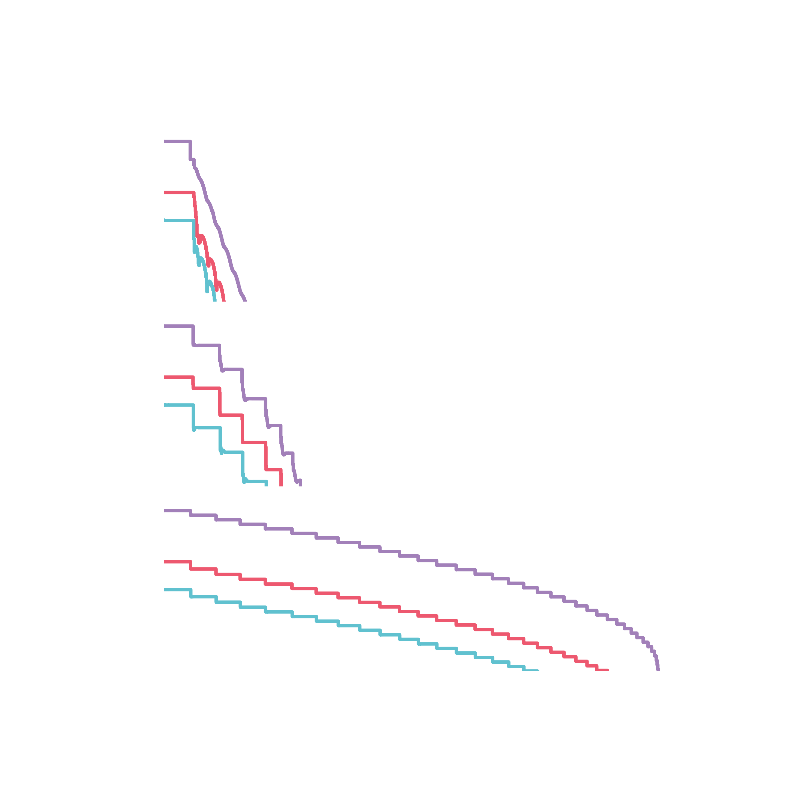

# Phenomena-based simulation benchmarks and graph representations

This repository contains benchmarks for phenomena-based simulation in BioSTEAM. 
Currently only convergence profiling for sequential modular, phenomena-based,
and hybrid simulation algorithms have been implemented. 

## Installation

After installing the anaconda distribution for Python 3.12 (https://www.anaconda.com/download), 
run the following commands in your terminal or command line:

```
$ pip install git+https://github.com/yoelcortes/phenomenode.git
$ pip install python-graphviz
```

## Getting Started

This section is organized by publication title. 

### Phenomena-Based Graph Representations and Applications to Chemical Process Simulation

View a list of registered systems for benchmarking as follows:

```python
>>> import benchmark
>>> benchmark.benchmark_systems_2025
('acetic_acid_simple',
 'acetic_acid_simple_ideal',
 'acetic_acid_complex',
 'acetic_acid_complex_ideal',
 'butanol_purification',
 'haber_bosch_process')
```

Generate convergence profiles. The plot images will be saved in benchmark/images: 

```python
>>> import benchmark
>>> benchmark.plot_profile(
...     'acetic_acid_simple',
...     load=True, # Use False to rerun simulations
... )
```


```python
>>> import benchmark
>>> benchmark.plot_profile(
...     'acetic_acid_simple_ideal',
...     load=True, 
... )
```


Generate excel spreadsheets of simulation data for all benchmark systems. 
The excel files will be stored in benchmark/simulations:

```python
>>> import benchmark
>>> benchmark.save_all_system_reports()
```